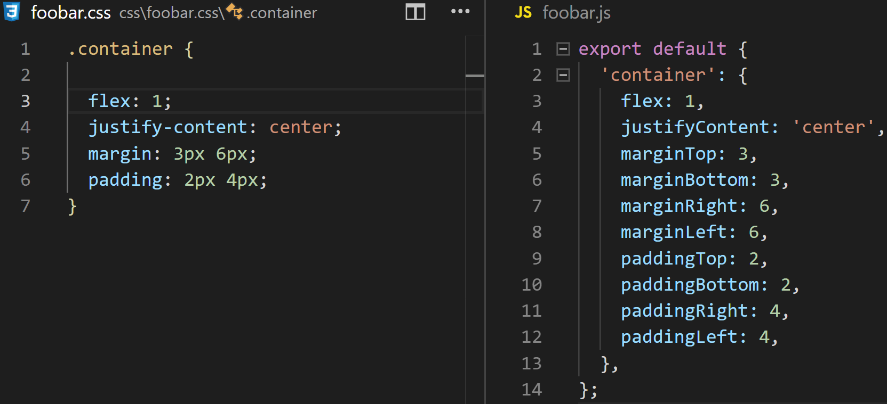

# [react-native-style-parser](https://npmjs.com/package/react-native-style-parser)


> Command line interface transform css files to javascript object

You want create a app [react-native](https://reactnative.dev/) but write you style inside **javascript object** is not you enjoy
now you can convert **css files** to **javascript object**.



- [installation](#installation)

- [config](#config)

- [usage](#usage)
  - [single file](#single-file)
  - [directory](#directory)
  - [options](#options)
    - [watch](#watch)
    - [es6](#es6)
    - [no-quote](#no-quote)
    - [optimize](#optimize)
- [other](#other)

## installation

Can local or global install this package

```bash
> npm install --save-dev react-native-style-parser
```

or with yarn

```bash
> yard add react-native-style-parser -D
```

or global

```bash
> npm install --global react-native-style-parser
```

## config

After installation from **package.json** add key *script* for access to command line

```json
{
  "scripts": {
    "build-style": "react-native-style-parser"
  }
}
```

For check access to command try show version with **--version** option

```bash
> npm run build-style -- --version
```

# usage

Usage of command line interface is easy and fast,
**react-native-style-parser** convert `class` selectors from css files.

Only class selectors is transform,
but you can ignore a specific `class` selector with
a annotation inside body style.

*e.g*

foobar.css
```css

.container {

  flex: 1;
  margin: 3px 5px;
  z-index: 3;
}

.style-for-my-web-view {
  /**
  * @CssParser/Ignore
  */
  width: 65%;
  margin: auto;
}
```

foobar.js
```js
export default {

  "container": {
    flex: 1,
    marginTop: 3,
    marginBottom: 3,
    marginLeft: 5,
    marginRight: 5,
    zIndex: 3
  }
}
```

Any block styles can be ignore with annotation: **@CssParser/Ignore**


### single file

Transform a single file with **command line interface**
with **relative path** of **css file**.

```bash
> npm run build-style -- ./css/foobar.css to ./react-styles/
```

If not exists `./react-styles/foobar.js` is auto append.

After below parse *javascript object styles* at: `./react-styles/foobar.js`

### directory

Can transform all css files from a folder with **command line interface**

```bash
> npm run build-style -- ./css/ to ./react-styles/
```

### options

Can add behavior with **options** use `--option-name`

#### watch

Option **watch** allow auto parse after listen change inside a target file.

```bash
> npm run build-style -- ./css/ to ./react-styles/ --watch
```

#### es6

Option **watch** generate export with ES6 syntaxe.

Default behavior generate a export with *nodejs syntaxe*

```bash
> npm run build-style -- ./css/ to ./react-styles/ --es6
```

#### no-quote

Option **no-quote** generate property name with no quote.
Default behavior generaye single quote.

```bash
> npm run build-style -- ./css/ to ./react-styles/ --no-quote
```

#### optimize

Option **optimize** generate a minimified styles for optimization run time,
use before switch prod env.

```bash
> npm run build-style -- ./css/ to ./react-styles/ --optimize
```

### other

For not use *double dash option (--)* , prepare command from **package.json**

```json
"script": {
  "build-style": "react-native-style-parser ./css to ./react-styles/ --es6 --no-quote --watch",
  "build-style-prod": "react-native-style-parser ./css to ./react-styles/ --es6 --no-quote --optimize"
}
```


> The next minor version will add support for parsing [transform](https://reactnative.dev/docs/transforms#transform) property

Please if you detect undetermined behavior open a [issue](https://github.com/Orivoir/css-parser/issues)
